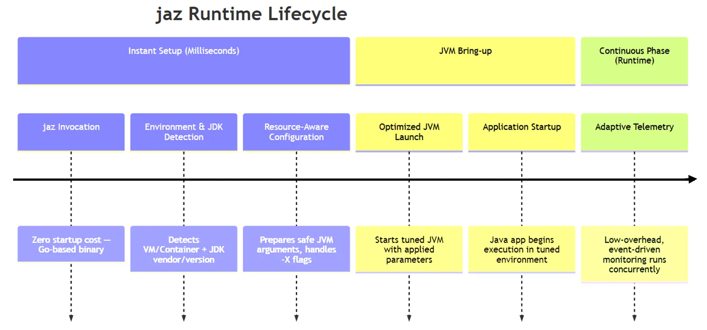

jaz Spring Boot demo
========================

jaz is a lightweight utility that simplifies how Java developers run their applications on Azure.
By intelligently applying Java Virtual Machine (JVM) options tailored for cloud environments,
the tool reduces configuration overhead and improves resource utilization out of the box, with higher potential for
better performance.

This tool is ideal for developers who:

- Want better JVM defaults without diving deeply into tuning guides.
- Develop and deploy cloud native microservices with frameworks like Spring Boot, Quarkus, or Micronaut.
- Prefer container-based workflows such as Kubernetes and OpenShift.
- Deploy Java workloads on Azure Container Apps, Azure Kubernetes Service, or Azure Virtual Machines.

No code changes, no lock-in. Just replace: `java -Xmx1024m -jar myapp.jar` to `jaz -jar myapp.jar`,
and jaz will manage the JVM configuration automatically


            
# Get Started
 
- Build project: `mvn -DskipTests clean package`
- Start project with docker compose: `docker compose up -d`

# FAQ

### jaz is a java shim?

Almost yes. jaz is a java shim that launches your application with the correct JVM options.

```
root@727b1c5114b1:/usr/bin# ./jaz --version
openjdk 21.0.9 2025-10-21 LTS
OpenJDK Runtime Environment Microsoft-12574458 (build 21.0.9+10-LTS)
OpenJDK 64-Bit Server VM Microsoft-12574458 (build 21.0.9+10-LTS, mixed mode, sharing)
root@727b1c5114b1:/# jaz --help
Usage: java [options] <mainclass> [args...]
           (to execute a class)
   or  java [options] -jar <jarfile> [args...]
           (to execute a jar file)
```

### How many processes are running in the container?

There are two processes running in the container: `ps eaf` or `docker top container_id aux`

```
UID        PID  PPID  C STIME TTY          TIME CMD
root         1     0  0 03:35 ?        00:00:00 jaz -jar application.jar
root        15     1 21 03:35 ?        00:00:18 /usr/bin/java -XX:NativeMemoryTracking=summary -XX:+UseG1GC -Xmx5243m -XX:MinHeapFreeRatio=10 -XX:MaxHeapFreeRatio=50 -XX:+Un
```

And jaz will launch the application with the following command:

```
/usr/bin/java -XX:NativeMemoryTracking=summary -XX:+UseG1GC -Xmx5256m 
-XX:MinHeapFreeRatio=10 -XX:MaxHeapFreeRatio=50 -XX:+UnlockExperimentalVMOptions 
-XX:+G1UseTimeBasedHeapSizing -XX:G1PeriodicGCInterval=10000 -jar application.jar
```

### What is language to develop jaz?

jaz is written in Golang, and binary size is about 10MB.

```
root@e7d7c3b5596d:/# strings /usr/bin/jaz | grep -i "go1\."
go1.24.10 X:systemcrypto
/home/cloudtest_azpcontainer/.local/share/microsoft-go/go1.24.10-1
/home/cloudtest_azpcontainer/.local/share/microsoft-go/go1.24.10-1/src/internal/abi/abi.go
```

### Memory usage of jaz

jaz memory usage:

- VSZ(Virtual memory size): 2054500
- RSS(Resident memory size): 25308

```
root         1  0.0  0.3 2054500 25500 ?       Ssl  03:41   0:00 jaz -jar application.jar
```

# References

* [jaz: Azure Command Launcher for Java](https://learn.microsoft.com/en-ca/java/jaz/overview)
* [Announcing the Public Preview of Azure Command Launcher for Java](https://devblogs.microsoft.com/java/announcing-the-public-preview-of-azure-command-launcher-for-java/)
* [From Complexity to Simplicity: Intelligent JVM Optimizations on Azure](https://devblogs.microsoft.com/java/from-complexity-to-simplicity-intelligent-jvm-optimizations-on-azure/) 
